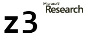

# Z3 Practise

Z3 is a Satisfiability Modulo Theories (SMT) solver from Microsoft Research.

https://github.com/Z3Prover/z3

## References

* [Satisfiability modulo theories](https://en.wikipedia.org/wiki/Satisfiability_modulo_theories)
* [Programming constraint services with Z3](http://theory.stanford.edu/~nikolaj/nus.html) [NUS 2016]
* Verified Software Summer School, Shanghai, Aug 2012 [Lecture 1](https://www.microsoft.com/en-us/research/wp-content/uploads/2016/02/nbjorner-shanghai-8-29-2012.pptx) [Lecture 2](https://www.microsoft.com/en-us/research/wp-content/uploads/2016/02/nbjorner-shanghai-8-30-2012.pptx) [Lecture 3](https://www.microsoft.com/en-us/research/wp-content/uploads/2016/02/nbjorner-shanghai-8-31-a-2012.pptx) [Lecture 4](https://www.microsoft.com/en-us/research/wp-content/uploads/2016/02/nbjorner-shanghai-8-31-b-2012.pptx) 
* [Z3: An Efficient SMT Solver](http://nikolajbjorner.github.io/slides/Z3_System.pdf), TACAS, Budapest, Hungary, 2008 ([Powerpoint Slides](http://nikolajbjorner.github.io/slides/Z3_System.pptx)).